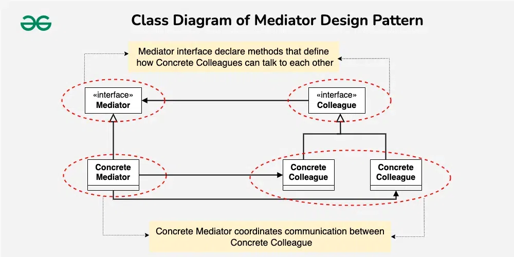

Mediator Design Pattern is in the category of behavioral design patterns and is used to centralize communication and collaboration between objects. The Mediator pattern prevents objects from communicating directly with each other, allowing all communication to occur through a mediator. This reduces the dependencies between objects and makes the system more loosely coupled.

                    Working Principle
* Mediator: Determines the rules of communication and coordination between objects.

* Colleague: Independent objects that communicate with other objects through the Mediator.

* Concrete Mediator: A concrete implementation of the class that carries out and manages communication.

                        Scenario
Consider a "chat app." Users in the app message each other. The Mediator design pattern allows for a central class to be created that relays each user's message to other users.

                        When to Use

- When communication between multiple objects becomes complex.

- When it is necessary to move communication logic to a central class.

- When it is necessary to reduce dependencies between objects.

